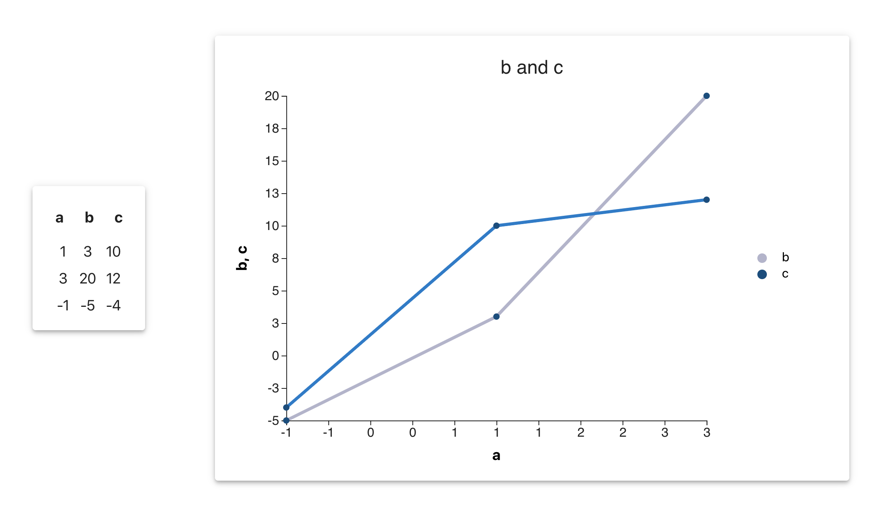

## About
This is a front-end web app that displays data as a table and a chart. As a user, you can see changes to the data inputs dynamically update in the table and chart.

  

## Instructions
1. npm install (to install dependencies)
2. npm start (to run the app locally in development mode; the page will re-load if you make edits)
3. Open [http://localhost:3000](http://localhost:3000) to view it in the browser
4. Update the data inputs for the table and chart by manipulating the variable called "data" at the top of the src/App.js file. Upon saving changes, the data updates will be reflected in the table and chart.

## Technologies Used
- Javascript
- React
- D3.js
- HTML
- CSS
- Material UI

To build the app, React was used to create a user interface that renders changes in state in a performant way. React was also used to develop modular and re-usable components to display updates to the table and the chart. D3.js, a powerful Javascript data visualization library, was used to perform the calculations to create the table and the chart. HTML, CSS, and Material UI components were used to create a clean and user-friendly interface.

This project was bootstrapped with [Create React App](https://github.com/facebook/create-react-app).

## Other Available Scripts

In the project directory, you can run:

### `yarn test`

Launches the test runner in the interactive watch mode. 
See the section about [running tests](https://facebook.github.io/create-react-app/docs/running-tests) for more information.

### `yarn build`

Builds the app for production to the `build` folder. 
It correctly bundles React in production mode and optimizes the build for the best performance.

The build is minified and the filenames include the hashes. 
Your app is ready to be deployed!

See the section about [deployment](https://facebook.github.io/create-react-app/docs/deployment) for more information.

