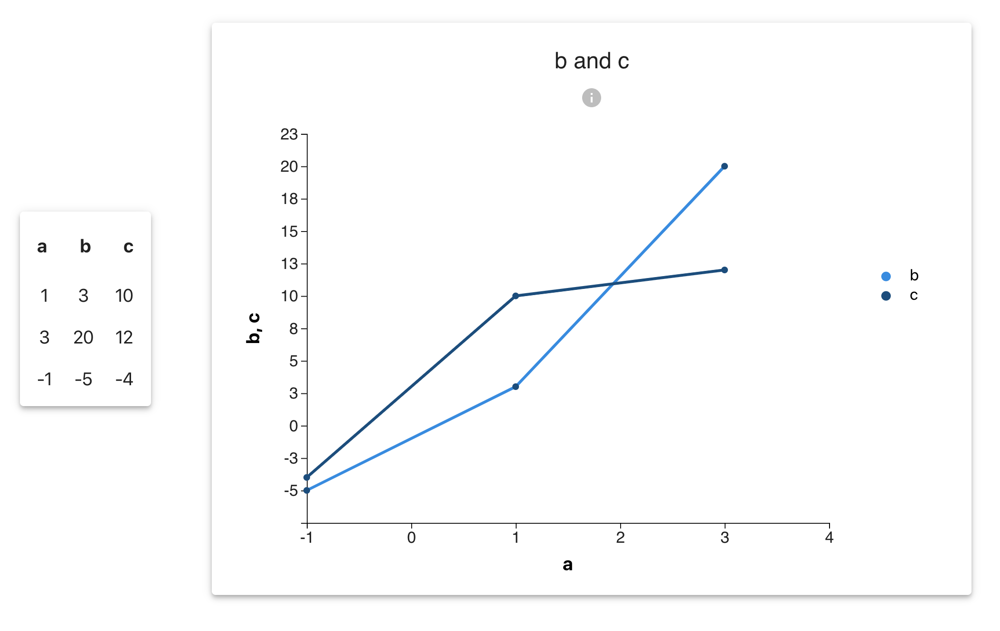
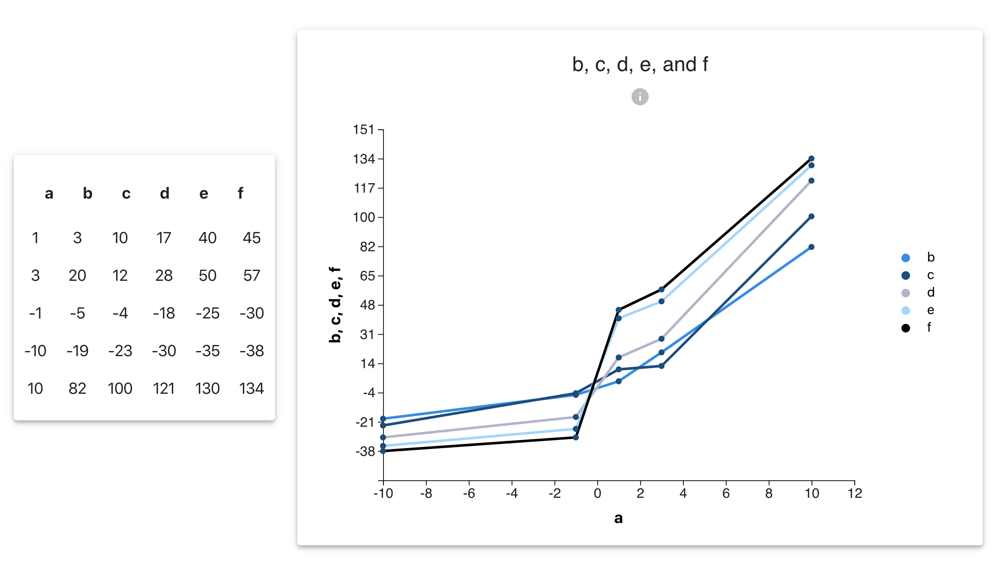

## About the Table and Chart App
This is a front-end web app that displays data as a table and a chart. As a user, you can see the table and chart data update dynamically when the data inputs are changed. The table and chart were built in a modular way to be re-usable.

## How to Run the App
1. Fork and clone this repo
 npm install (to install dependencies)
2. npm start (to run the app locally in development mode; the page will re-load if you make edits)
3. Open [http://localhost:3000](http://localhost:3000) to view it in the browser
4. Update the data inputs for the table and chart by manipulating the variable called "data" at the top of the src/App.js file. There are two versions of the "data" variable provided, one smaller data set, and one larger, which you can select from to demo. Upon saving changes, the data updates will be reflected in the table and chart.

The main React components and D3.js files for the chart and table can be found in the src folder and labelled as chart-d3.js, chart-wrapper.js, table-d3.js, and table-wrapper.js. The main parent component is in App.js.

## Technologies Used
- Javascript
- React
- D3.js
- HTML
- CSS
- Material UI

To build the app, React was used to create a user interface that renders changes in state in a performant way. React was also used to develop modular and re-usable components to display updates to the table and the chart. D3.js, a powerful Javascript data visualization library, was used to perform the calculations to create the table and the chart. HTML, CSS, and Material UI components were used to create a clean and user-friendly interface.

A challenge in building this app was creating responsive layout and styling as well as charts that update dynamically to accomodate varying input data sizes.

This project was bootstrapped with [Create React App](https://github.com/facebook/create-react-app).
